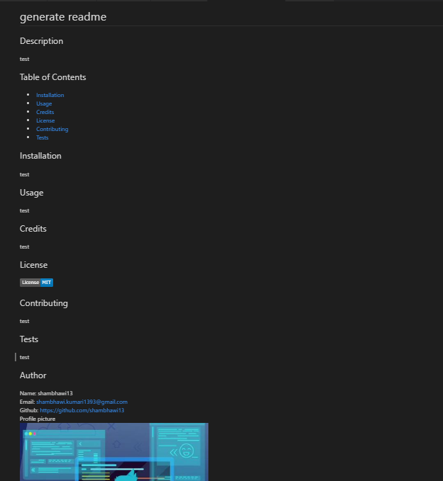

# ReadMe-Generator

This is a node application that generates readme just by providing set of questions asked by user. The application takes care of retrieving user avatar and email by hitting github api using axios. It also validates and remove the section which is not given by user. User has to provide following list of questions :

- Provide github username
- What is your project title?
- Describe your project?
- Explain process of installation
- How can your application be used?
- license detail
- List all contributors
- Describe steps how developer can contribute to your project.
- Enter any test you have written.


```
Here is how the application works:
```


```
Final Result
```



## Prerequisites

- git clone https://github.com/shambhawi13/ReadMe-Generator.git
- node and npm installed
- navigate to folder where you cloned the application
- RUN node index.js
- generated.md is generated


## Technologies Used
- JavaScript - Core logic
- Git APIs
- Node and NPM
- Axios package
- Inquirer package
- Git - version control system to track changes to source code
- GitHub - hosts repository that can be deployed to GitHub Pages

## Installing

- Clone the repository : git clone https://github.com/shambhawi13/ReadMe-Generator.git

## Authors

* **Shambhawi Kumari**
 [GitHub](https://github.com/shambhawi13/) | 
 [LinkedIn](https://www.linkedin.com/in/shambhawi-kumari/)


## Review URL

[GitHub](https://github.com/shambhawi13/ReadMe-Generator)


